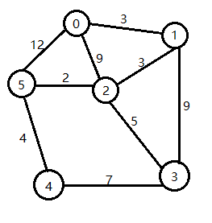

# OCaml-test
ShortestPath Algorithm: Dijkstra in OCaml

This is graph which we input:

And then run it you will see Output:

Distance 0 to 1 : 3.000000	and the path is: 0->1

Distance 0 to 2 : 6.000000	and the path is: 0->1->2

Distance 0 to 3 : 11.000000	and the path is: 0->1->2->3

Distance 0 to 4 : 12.000000	and the path is: 0->1->2->5->4

Distance 0 to 5 : 8.000000	and the path is: 0->1->2->5
